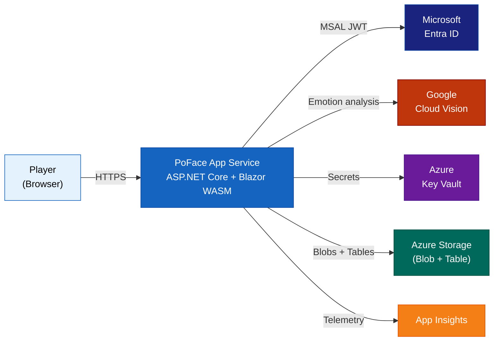

# PoFace::Arcade

A browser-based facial emotion game. Match 5 target emotions with your webcam. Google Cloud Vision scores your performance 0–10 per round (50 max). Compete on the per-year leaderboard. Share your recap.

---

## Architecture Overview

PoFace is a single-deployment app: an ASP.NET Core 10 API that hosts the Blazor WebAssembly SPA. Deployed to Azure App Service (Linux, .NET 10) via Azure Developer CLI.



**Key facts:**
- No SQL database — all persistence via Azure Table Storage (schemaless)
- No Redis — leaderboard is queried directly from Table
- Authentication is optional — anonymous play is fully supported
- Round images stored in Azure Blob Storage with lifecycle expiry

---

## Quick Start

```bash
# Start Azurite (Azure Storage emulator)
docker compose up -d

# Run the app at http://localhost:5000
dotnet run --project src/PoFace.Api/PoFace.Api.csproj
```

See [docs/DevOps.md](docs/DevOps.md) for full environment setup, secrets, and deployment instructions.

---

## Game Rules

| Round | Target Emotion |
|---|---|
| 1 | Happiness 😄 |
| 2 | Surprise 😲 |
| 3 | Anger 😠 |
| 4 | Sadness 😢 |
| 5 | Fear 😨 |

- Max score: **50 points** (10 per round)
- Scoring: `Round(confidence × 10)` from Google Cloud Vision
- Head pose gate: face must be within ±20° yaw and pitch
- Authenticated players can save personal bests to the leaderboard

---

## Documentation

| File | Description |
|---|---|
| [docs/ProductSpec.md](docs/ProductSpec.md) | PRD — business logic, feature definitions, success metrics |
| [docs/DevOps.md](docs/DevOps.md) | CI/CD, environment secrets, Docker Compose, azd deployment, blast radius |
| [docs/Architecture.mmd](docs/Architecture.mmd) | C4 Level 1 — full Azure system context diagram |
| [docs/Architecture_SIMPLE.mmd](docs/Architecture_SIMPLE.mmd) | Simplified architecture overview |
| [docs/SystemFlow.mmd](docs/SystemFlow.mmd) | Sequence diagram — auth flow + full game round data pipeline |
| [docs/SystemFlow_SIMPLE.mmd](docs/SystemFlow_SIMPLE.mmd) | Simplified system flow |
| [docs/DataModel.mmd](docs/DataModel.mmd) | ER diagram — all Table Storage entities and relationships |
| [docs/DataModel_SIMPLE.mmd](docs/DataModel_SIMPLE.mmd) | Simplified data model |

---

## Tech Stack

| Layer | Technology |
|---|---|
| Backend | ASP.NET Core 10 Minimal API, MediatR (CQRS) |
| Frontend | Blazor WebAssembly 10, Radzen Blazor components |
| Auth | Microsoft Entra ID (MSAL), `Microsoft.Identity.Web` |
| Storage | Azure Table Storage + Azure Blob Storage |
| Vision | Google Cloud Vision API v1 |
| Infra | Azure App Service (Linux), Azure Key Vault, App Insights |
| IaC | Bicep + Azure Developer CLI (`azd`) |
| Testing | xUnit, Playwright (E2E), TestContainers/Azurite |
| Logging | Serilog + OTel → Azure Monitor |

---

## API Reference

Interactive API docs available at `/scalar` when running locally.

| Endpoint | Description |
|---|---|
| `POST /api/sessions` | Start a new game session |
| `POST /api/sessions/{id}/rounds/{n}/score` | Upload JPEG frame and get round score |
| `POST /api/sessions/{id}/complete` | Finalize session and compute total score |
| `DELETE /api/sessions/{id}` | Discard an in-progress session |
| `GET /api/leaderboard?top={n}` | Fetch top-N leaderboard entries for current year |
| `GET /api/recap/{id}` | Fetch full recap with round images and scores |
| `GET /api/auth/me` | Return caller identity (requires auth) |
| `GET /api/diag` | Live health check and masked config (requires auth) |
